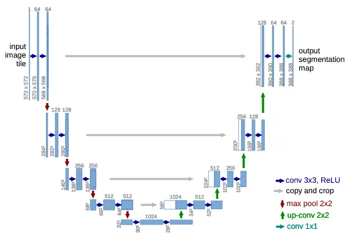

# Major Credits

Thank you to DeepFindr for the video on creating a relatively simple diffusion model in PyTorch. 
https://www.youtube.com/watch?v=a4Yfz2FxXiY

Thank you to FernandoPC25 for the article on UNETs and inspiring my dynamic architecture - https://medium.com/@fernandopalominocobo/mastering-u-net-a-step-by-step-guide-to-segmentation-from-scratch-with-pytorch-6a17c5916114

Thank you to PvJosue for trying to make recursive convolution before me - https://github.com/pvjosue/pytorch_convNd/blob/master/LICENSE

# Welcome

This is some practice I did with creating a dynamic UNET architecture model. It started when I wanted to learn stable
diffusion and with all the tutorials I saw, it always involved some kind of UNET architecture that looked confusing
upon first glance. 

It made me quit for a second and after a couple of months, I gave it another shot, starting with just the basic UNET
at first. Starting with just a UNET let me learn how that worked, and after getting something to work, I created a
structure that created the encoder and decoder as a list of blocks based on whatever list of channels I fed it. That
way, I wouldn't have to manually add blocks to my model every time I wanted to alter it.

From there, I learned what Attention was and created my own simple version of that with some guidance. From there, I
beefed up the model with some batch modularization, activation functions, and added the ability to enable and disable
stuff through optional parameters. Lastly, I added the ability to use time embeddings and created a diffusion "shell"
model that can sit around the UNET to handle all the denoising steps for a complete diffusion model.

Lastly, I pulled from existing resources, and creating a model that could handle any number of dimensions. After
figuring out convolution, I took out a whiteboard and marker and worked out how the rest of the dimension-specific
operations would work, and I think I got everything figured out.

Now I'm just improving the functionality and adding onto everything, so I can write a section on how everything works

# How the UNET System works

From my understanding, a UNET is an encoder-decoder model that utilizes skip connections between the encoder and
decoder parts of the network. An image is shown below showing the visuals of a basic UNET.

The UNET uses convolutional layers and pooling layers to reduce the spatial dimensions of the data while increasing
the channels of the data, with the purpose being that important information can be gradually extracted as the data
progresses through the encoder. The bottom of the encoder is the bottleneck - the deepest encoding that can be done.

Once the bottleneck is reached, special outputs called _skip connections_ are fed into the decoder portion of the model,
along with upscaled encodings from the encoder. Combining the skip connections and the up-scaled encodings allows for
short-term and long-term information to be used in a nuanced manner.

Each phase of the encoding and decoding is largely defined by the amount of filter channels that are used through
convolution and convolution transpose operations. Levels of channels that are encoded into the model must be used in
reverse order to decode, resulting in a "U"-like architecture.

From there, additional operations can be added to the model to further enhance the results, such as attention and 
residual connections.

# Understanding the Code

I take advantage of the symmetrical model to generate the UNET as a set of downsampling and upsampling blocks, with
a bottleneck module in the middle of both. Each downsampling block represents the convolution and pooling operations,
and each upsampling block represents the deconvolution and unpooling operations. Both are configured with boolean
parameters that enable more operations such as ReLU activation, along with larger modules like an Attention block.

A large amount of the code is split by dimension, so I have dedicated modules for a 1D, 2D, 3D, and ND UNET, where "N"
represents a larger number of dimensions whose operations can be derived through recursive 3D operations. However,
for ML analysis you would only interact with the UnetModel module, which holds wrapper UNET classes that have 
functionality for training and saving progress and the best UNET models at each epoch. Right now, there is a general 
wrapper for normal learning, and a diffusion wrapper for denoising diffusion.

The Testing python files are just examples I used to test the functionality of the UNETs.

# Google Colab Link

You can use GPUs for free as of February 2025, but it has a limited runtime. You can just copy my stuff into your own 
notebook if you want. There is also a requirements folder to timestamp what library versions I use.

https://colab.research.google.com/drive/1lOn-XvXf3O6jaqZSc4LVkkmBC5E6EHf7?usp=sharing

After I found out about the limited runtime, I had to create my own local environment. I have an nvidia drive, and
pytorch has resources on how to download the necessary stuff. https://pytorch.org/get-started/locally/

My suggestion is to pick a drive with a decent amount of space you can play around and create a virtual environment,
and when you are installing, pick a place with a good connection. The cuda-enabled pytorch installation took up around
2.5GB of space. I have a requirements.txt file that shows the names of the packages I used for this project.
