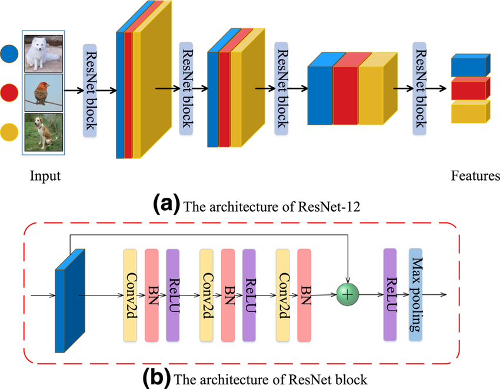

# Major Credits

Throughout the making of this package I used alot of resources from the internet. They all can be found in the 
 file in this repository. It was a mix of YouTube, online guides, and scholarly
articles that helped me put this together, and I hope you find use out of it as well!

# Welcome

This is the Various Dimension UNET-ResNet package. It is a collection of model wrappers that can be easily interacted
with to create a model, then train and test with only a few lines of code, in addition to some other utilities to
enable residual connections, multiple variations of attention, and embeddings.

It started when I wanted to learn stable diffusion and with all the tutorials I saw, it always involved some kind of 
UNET architecture. I was coming into this topic with only enough knowledge on generative AI to follow along on the
Tensorflow GAN and VAE tutorials, so with all the added complexity it looked very confusing. It didn't help that I was
in the middle of school at that time, so I didn't have much energy to spare to learn.

During the winter of 2024-2025 it crossed my mind again so I decided to give it another shot. I started by learning how
to create a basic UNET, and once I got it to work, I got to work playing around with the UNET architecture. The main
issue I wanted to solve was that repo and example I could find was static, and I wanted to be able to dynamically
change things without having to go through the entire codebase and creating new numbers. It didn't help that everyone
had their own way to code, so I was stuck trying to compare and contrast different codes and graphs to see how I can
incorporate more complex features.

I decided to solve this problems by creating a UNET class that could generate its own structure, given only a list of 
channels to downsample then upsample from. Creating the basic form of it worked great, and with some struggle I was
able to then add Attention, time-step embeddings, and residual connections into specific parts of the UNET. I even had
the idea to create a theoretically infinite-dimensional UNET that could work with any dimension of data. Version
1 in the package is essentially that. 

However, as I was discovering more ways to alter a UNET, and other structures such as a ResNet, I realized that my code
was getting too bloated to keep adding features. I decided to start fresh and design a new module system that could 
incorporate my new ideas better, which is where Version 2 comes in. In version 2, I was able to redesign the 
embeddings to work better with my input data, modularize attention so that it can be placed anywhere I wanted, and
further modularize the DoubleConv module I used for UNET so I can pass in any number of convolutions I wanted (meaning
it could now be used to design a ResNet). After a lot of large additions and small quality of life improvements, it was
better than ever before, and was generalized enough to create anything I wanted.

# How UNETs and ResNets work

From my understanding, a UNET is an encoder-decoder model that utilizes skip connections between the encoder and
decoder parts of the network. An image is shown below showing the visuals of a basic UNET.


Caption: Basic UNET Architecture with skip connections from [Seg-UNET](https://github.com/chenghuige/Seg-UNet)

The UNET uses convolutional layers and pooling layers to reduce the spatial dimensions of the data while increasing
the channels of the data, with the purpose being that important information can be gradually extracted as the data
progresses through the encoder. The bottom of the encoder is the bottleneck - the deepest encoding that can be done.

Once the bottleneck is reached, special outputs called _skip connections_ are fed into the decoder portion of the model,
along with upscaled encodings from the encoder. Combining the skip connections and the up-scaled encodings allows for
short-term and long-term information to be used in a nuanced manner.

Each phase of the encoding and decoding is largely defined by the amount of filter channels that are used through
convolution and convolution transpose operations. Levels of channels that are encoded into the model must be used in
reverse order to decode, resulting in a "U"-like architecture.

ResNets are a completely different model setup, but can be thought of as a UNET that has had its decoder removed.



Caption: The detail architecture of the embedding function ResNet‐12. (a) The architecture of ResNet‐12. (b) The 
architecture of one ResNet block. From [Multi‐task few‐shot learning with composed data augmentation for image 
classification](https://www.researchgate.net/publication/364330865_Multi-task_few-shot_learning_with_composed_data_augmentation_for_image_classification)

ResNets encode spatial information into deeper and deeper channels, until at the very end where everything is 
aggregated for classification or other purposes. ResNets get their name from residual connections that are added at the
end of each step. This connection brings information from the beginning of the step to help "remember" information that
may have otherwise been forgotten.

# Understanding the Code

## Checking for CUDA and Installing

First off, check to see if you have cuda on your device because alot of the code is written to prefer running on the 
GPU. To do this, open a command prompt and enter `nvidia-smi`. You should see an output similar to the following:

```
+-----------------------------------------------------------------------------------------+
| NVIDIA-SMI 560.94                 Driver Version: 560.94         CUDA Version: 12.6     |
|-----------------------------------------+------------------------+----------------------+
| GPU  Name                  Driver-Model | Bus-Id          Disp.A | Volatile Uncorr. ECC |
| Fan  Temp   Perf          Pwr:Usage/Cap |           Memory-Usage | GPU-Util  Compute M. |
|                                         |                        |               MIG M. |
|=========================================+========================+======================|
|   0  NVIDIA GeForce RTX 3080 ...  WDDM  |   00000000:01:00.0 Off |                  N/A |
| N/A   46C    P8             18W /   40W |       0MiB /  16384MiB |      0%      Default |
|                                         |                        |                  N/A |
+-----------------------------------------+------------------------+----------------------+

+-----------------------------------------------------------------------------------------+
| Processes:                                                                              |
|  GPU   GI   CI        PID   Type   Process name                              GPU Memory |
|        ID   ID                                                               Usage      |
|=========================================================================================|
+-----------------------------------------------------------------------------------------+
```

If you have cuda, the version would be at the top of the output where it says 'CUDA Version'.

Next, download/clone the repository into a folder of your choice and open a command prompt in that folder.

After that, to install the necessary dependencies, run the following command: `pip install -r requirements.txt 
--index-url https://download.pytorch.org/whl/cu126`. I use the 'cu126' link because my cuda version is 12.6, but you 
should check for yours at the [Pytorch Start Locally](https://pytorch.org/get-started/locally/) page to ensure nothing
breaks. If your CUDA version is different from the ones available, then seek further help on how to install a supported 
one.

## How to Use the Package

The main way to utilize the package is to use the wrappers that are brought up in each version, or to use the
higher dimensional embeddings for your own purposes. 

Version 1 has the following modules available:

* GeneralUNETModel - UNET model wrapper for general purposes
* DiffusionUNETModel - UNET model wrapper for denoising diffusion
* ConvNd - Module for conducting convolution in dimensions higher than 3 
* ConvTransposeNd - Module for conducting convolution transpose in dimensions higher than 3
* BatchNormNd - Module for conducting batch normalization in dimensions higher than 3
* MaxPoolNd - Module for conducting max pooling in dimensions higher than 3
* AvgPoolNd - Module for conducting average pooling in dimensions higher than 3
* InterpolateNd - Module for conducting interpolation in dimensions higher than 3

Version 2 has the following modules available:

* GeneralUNETModel - UNET model wrapper for general purposes
* DiffusionUNETModel - UNET model wrapper for denoising diffusion
* GeneralResNetModel - ResNet model wrapper for general purposes
* DiffusionResNetModel - ResNet model wrapper for denoising diffusion
* ResNetArgs - Class for specifying ResNet arguments
* ResNetPresets - Enum for specifying ResNet presets
* DiffPosEmbeds - Module for creating diffusion positional embeddings
* AttnPosEmbeds - Module for creating positional embeddings. Mainly used for Attention
* AttentionArgs - Class for specifying arguments to Attention wrapper.
* AttentionOptions - Enum for specifying types of attention.
* Attention - Wrapper module for creating a single or custom list of attention operations.
* ConvNd - Module for conducting convolution in dimensions higher than 3 
* ConvTransposeNd - Module for conducting convolution transpose in dimensions higher than 3
* BatchNormNd - Module for conducting batch normalization in dimensions higher than 3
* MaxPoolNd - Module for conducting max pooling in dimensions higher than 3
* AvgPoolNd - Module for conducting average pooling in dimensions higher than 3
* InterpolateNd - Module for conducting interpolation in dimensions higher than 3

Of course, you can do whatever you want with the code once you download it, but this is the usual stuff you can put in. 
You can import any module by doing "from UNETPyTorch.V[num] import [module]" where [num] is the version number and 
[module] is the module you want, or some variant of that.

## Example 1: MNIST Number Analysis

Below is a code example of using the General UNET Models to analyze the MNIST number data. Both version one and version
two are used to compare how similar they perform. Ideally, both should achieve the same levels of accuracy as the
version improvements were mainly supposed to make it easier to incorporate more complex features. The code can be found
[here](./MNIST Testing.py).

```
from UNETPyTorch.V1 import GeneralUNETModel as GenUnetOne
from UNETPyTorch.V2 import GeneralUNETModel as GenUnetTwo
from UNETPyTorch.V2 import AttentionOptions

import torch.nn as nn
import torch.nn.functional as F

from torch.utils.data import DataLoader
from torchvision import datasets, transforms
import matplotlib.pyplot as plt


# Create the output layer
class PoolSoftmaxOutput(nn.Module):
    def __init__(self, in_channels, out_classes):
        super().__init__()
        # 1x1 Convolution to go from UNET channels to MNIST classes
        self.final_conv = nn.Conv2d(in_channels=in_channels, out_channels=out_classes, kernel_size=1)

    def forward(self, unet_output):
        conv_output = self.final_conv(unet_output)

        # Global average pooling
        pooled_output = F.adaptive_avg_pool2d(conv_output, (1, 1))

        # Flatten down to 1 dimension
        class_output = pooled_output.view(pooled_output.size(0), -1)

        # Return the raw values of each class
        return class_output


# Specify normalization transformation for data
IMG_SIZE = 64
transform = transforms.Compose([
    transforms.Resize((IMG_SIZE, IMG_SIZE)),  # Resizes to a power of two for simple handling
    transforms.ToTensor(),  # Converts images to PyTorch tensors
    transforms.Normalize((0.5,), (0.5,))  # Normalize images (mean, std)
])

# Load MNIST dataset (training and test sets)
train_dataset = datasets.MNIST(root='./data', train=True, download=True, transform=transform)
test_dataset = datasets.MNIST(root='./data', train=False, download=True, transform=transform)

# Create DataLoader to load data in batches
BATCH_SIZE = 32
train_loader = DataLoader(train_dataset, batch_size=BATCH_SIZE, shuffle=True)
test_loader = DataLoader(test_dataset, batch_size=BATCH_SIZE, shuffle=False)

# Visualize a sample image to ensure it's loaded correctly
first_image, first_label = train_dataset[0]
plt.imshow(first_image.squeeze(), cmap='gray')  # MNIST is single-channel, using cmap='gray'
plt.title(f"Label: {first_label}")
plt.show()

# Create different model versions
dimensions = 2
channels = 1
conv_filters = [64, 128, 256, 512]
mnist_classes = 10
my_out_layer = PoolSoftmaxOutput(in_channels=conv_filters[0], out_classes=mnist_classes)
optim_loss_rate = 0.002

# Version 1
mnist_model_v1 = GenUnetOne(
    name='version_one_unet', in_dimensions=dimensions, in_channels=channels, conv_channels=conv_filters,
    out_layer=my_out_layer, use_up_atten=True, use_attn_pool=True, loss_rate=optim_loss_rate
)

# Version 2
spatial_attn_args = {
    'attn_order': [AttentionOptions.SPATIAL]
}
mnist_model_v2 = GenUnetTwo(
    name='version_two_unet', in_channels=channels, channel_list=conv_filters, out_layer=my_out_layer,
    data_dims=dimensions, up_attn_args=spatial_attn_args, loss_rate=optim_loss_rate
)

# Train the models
epoch_count = 1
print_count = 100
print_interval = max(1, len(train_loader) // print_count)
loss_module = nn.CrossEntropyLoss()
model_train_stats_one = mnist_model_v1.train_model(
    train_loader=train_loader, epochs=epoch_count, loss_func=loss_module, print_interval=print_interval
)
print(model_train_stats_one)
model_train_stats_two = mnist_model_v2.train_model(
    train_loader=train_loader, epochs=epoch_count, loss_func=loss_module, print_interval=print_interval
)
print(model_train_stats_two)

# Test the models
loss_module = nn.CrossEntropyLoss()
mnist_model_v1.test_model(test_loader=test_loader, loss_func=loss_module)
mnist_model_v2.test_model(test_loader=test_loader, loss_func=loss_module)
```

## Example 2: CIFAR Image Generation

Below is a code example of the Version 1 UNET diffusion model to create randomly generate images based on the CIFAR
dataset. It sucks, but the model itself works. The code can be found [here](./CIFAR Gen Testing.py).

```
from UNETPyTorch.V1 import DiffusionUNETModel

import torch
import torch.nn as nn
from torch.utils.data import DataLoader
from torchvision import datasets, transforms
import matplotlib.pyplot as plt


def load_transformed_dataset(img_size):
    data_transforms = [
        transforms.Resize((img_size, img_size)),
        transforms.RandomHorizontalFlip(),
        transforms.ToTensor(),  # Scales data into [0,1]
        transforms.Lambda(lambda t: (t * 2) - 1)  # Scale between [-1, 1]
    ]
    data_transform = transforms.Compose(data_transforms)

    train = datasets.CIFAR10(root='./data', train=True, download=True, transform=data_transform)
    test = datasets.CIFAR10(root='./data', train=False, download=True, transform=data_transform)

    return torch.utils.data.ConcatDataset([train, test])


if __name__ == '__main__':
    # Get data into dataloader
    IMG_SIZE = 64
    BATCH_SIZE = 100
    data = load_transformed_dataset(IMG_SIZE)
    dataloader = DataLoader(data, batch_size=BATCH_SIZE, shuffle=True, drop_last=True)

    # Create model
    dimensions = 2
    channels = 3
    conv_filters = [64, 128, 256, 512]
    mnist_classes = 10
    my_out_layer = nn.Conv2d(conv_filters[0], channels, 1)
    optim_loss_rate = 0.002
    time_steps = 300

    model = DiffusionUNETModel(
        name='unet_diffusion_cifar10_model', in_dimensions=dimensions, in_channels=channels, conv_channels=conv_filters,
        out_layer=my_out_layer, use_up_atten=True, use_attn_pool=True, use_dconv_res=True, loss_rate=optim_loss_rate,
        time_steps=time_steps, time_embed_count=32
    )

    print(model)

    # Simulate forward diffusion
    image = next(iter(dataloader))[0]

    plt.figure(figsize=(13, 2))
    plt.axis('off')
    num_images = 10
    step_size = int(time_steps/num_images)

    for idx in range(0, time_steps, step_size):
        t = torch.Tensor([idx]).type(torch.int64)
        plt.subplot(1, num_images+1, int(idx/step_size) + 1)
        img, noise = model.forward_diffusion_sample(image, t, torch.device('cpu'))
        model.show_tensor_image(img)

    plt.tight_layout()
    plt.show()

    # Train the model
    epoch_count = 1
    print_count = 100
    print_interval = max(1, len(dataloader) // print_count)
    model_train_stats = model.train_model(
        train_loader=dataloader, epochs=epoch_count, print_interval=print_interval,
        batch_size=BATCH_SIZE, sample_img_size=IMG_SIZE
    )

    print(model_train_stats)
```

## Example 3: Passing Attention and ResNet settings into V2 model wrappers.

Below is an example of how to pass in attention and resnet settings into the V2 model wrappers. Both dictionaries
and the actual dataclasses are used to show how the model can handle both. No data is examined, but it does show
a good job of showing how much better Version 2 is, including the print statements. The code can be found 
[here](./Version Two Testing.py).

```
from torch import nn
from UNETPyTorch.V2 import GeneralUNETModel, GeneralResNetModel, ResNetPresets, AttentionArgs, AttentionOptions


def transformer_unet(in_channels, spatial_dims, attn_pos_max_len):
    cbam_args = AttentionArgs(
        attn_order=[AttentionOptions.CHANNEL, AttentionOptions.SPATIAL],
        use_pos=True,
        pos_max_len=attn_pos_max_len
    )
    transformer_args = {
        'attn_order': [AttentionOptions.QKV], 'qkv_heads': 2, 'use_pos': True,
        'pos_max_len': attn_pos_max_len
    }
    return GeneralUNETModel(
        name='sample_model', in_channels=in_channels, channel_list=[64, 128, 256], out_layer=nn.Sigmoid(),
        data_dims=spatial_dims, up_drop_perc=0.5, up_attn_args=transformer_args,
        conv_act_fn=nn.LeakyReLU(0.2, inplace=True), conv_attn_args=cbam_args, conv_residual=True
    )


def res_net_fifty(in_channels, spatial_dims, out_classes, use_cbam=False):
    # Create CBAM Attention, this time using a attnargs class
    if use_cbam:
        cbam_args = AttentionArgs(attn_order=[AttentionOptions.CHANNEL, AttentionOptions.SPATIAL])
    else:
        cbam_args = None

    # Create ResNet with default 2D data handling
    return GeneralResNetModel('sample_model', in_channels, preset=ResNetPresets.RESNET18,
                              preset_out_classes=out_classes, data_dims=spatial_dims, conv_attn_args=cbam_args,
                              conv_residual=True)


if __name__ == "__main__":
    # Set the aspect size and channels
    test_data_size = 16
    test_data_dim = 4
    test_channels = 1
    test_batch_size = 1

    # Create a test UNET that uses CBAM Residual Convolution Blocks and Up-scaling Transformer Blocks
    var_dim_model = transformer_unet(test_channels, test_data_dim, test_data_size**test_data_dim)

    # View UNET summary
    print(var_dim_model)

    # Create a test ResNet that uses CBAM Residual Convolution Blocks
    var_dim_model = res_net_fifty(test_channels, test_data_dim, 10, use_cbam=True)

    # View ResNet summary
    print(var_dim_model)

```
